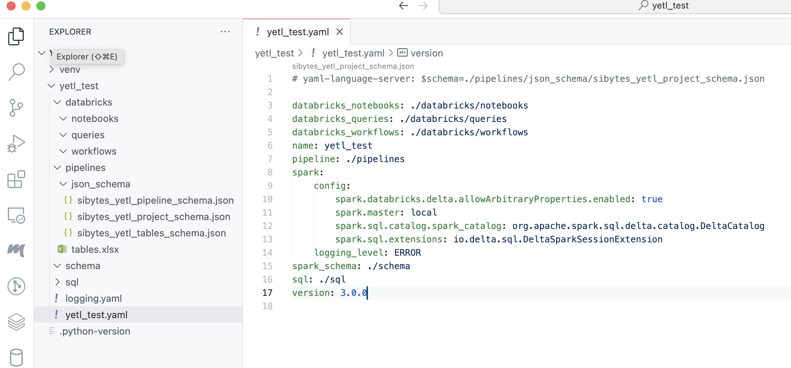

# Project

Yetl has the concept of project. A project houses all the assets to configure your pipelines, the pipelines themselves and deploymemnt assets. They are deployable products that can be a data feed or an individual component data feed product of something larger.

Although it's entirely possible to reconfigure the project structure a canonical structure is recommended since the API just works without any additional consideration for all of these environments:

- Local
- Databricks Workspace
- Databricks Repo

## Create a new project

Yetl has a built-in cli for common tasks. One of those common tasks is creating a new project.

Create a python virtual environment and install yetl:

```sh
mkdir yetl_test
cd yetl_test
python -m venv venv
source venv/bin/activate
pip install --upgrade pip
pip install yetl-framework
```

Create a new yetl project:

```sh
python -m yetl init test_yetl
```

This will create:

- logging configuration file `logging.yaml`
- yetl project configuration file `yetl_test.yaml` project configuration file.
- directory structure to build pipelines




- databricks - will store databricks workflows, notebooks, etc that will be deployed to databricks.
- pipelines - will sore yetl configuration for the data pipelines.
- sql - if you choose to define some tables using SQL explicitly and have yetl create those tables then the SQL files will go in here.
- schema - will hold the spark schema's in yaml for the landing data files when we autogenerate the schema's

## Project config

The `yetl_test.yaml` project file tells yetl where to find these folders. It's best to leave it on the defaults:

```yaml
databricks_notebooks: ./databricks/notebooks
databricks_queries: ./databricks/queries
databricks_workflows: ./databricks/workflows
name: test_yetl
pipeline: ./pipelines
spark:
    config:
        spark.databricks.delta.allowArbitraryProperties.enabled: true
        spark.master: local
        spark.sql.catalog.spark_catalog: org.apache.spark.sql.delta.catalog.DeltaCatalog
        spark.sql.extensions: io.delta.sql.DeltaSparkSessionExtension
    logging_level: ERROR
spark_schema: ./schema
sql: ./sql
version: 1.5.0.post1
```

It also holds a spark configuration, this is what yetl uses to create the spark session if you choose to run yetl code locally. This can be usefull for local development and testing in deveops pipelines. Since we are just leveraging pyspark and delta lake it's very easy to install a local spark environment however you will need java installed if you want to work this way.

The version attribute is also important this makes sure that you're using the right configuration schema for the specific version of yetl you're using. If these do not agree to the minor version then yetl will raise version incompatability errors. This ensures it's clear the metadata clearly denotes the version of yetl the it requires. Under the covers yetl uses pydantic to ensure that metadata is correct when deserialized.

## Logging config

The `logging.yaml` is the python logging configuration. Configure yetl logging as you please by altering this file.

## SQL

Sometimes there are requirements to explicitly create tables using SQL DDL statements. 

For example if you're loading a fan in pattern where multiple source tables are loading into the same destination table in parallel you cannot create the schema from the datafeed on the fly, either with or without the merge schema option. This is because delta tables are optimistically isolated and attempting the change the schema in multiple process will mostly likely cause a [conflict](https://docs.delta.io/latest/concurrency-control.html#metadatachangedexception). This is common pattern for audit tracking tables when loading bronze and silver tables (raw and base stages respectively)

You may also just find it more practical to manage table creation by explicitly declaring create table SQL statements. There is a feature in the road map to automatically snyc the table schema when changes are made, although that currently is not implemented.

In order to explicitly define tables using SQL:

1. Create a folder in the `sql` directory that is the database name e.g. `my_database`
2. Create a .sql file in the folder called the name of the table e.g. `my_table.sql`
3. Put a deltalake compatible create SQL statement in the sql file

e.g.

```
./sql/my_database/my_table.sql
```

For [example](https://github.com/sibytes/databricks-patterns/blob/main/header_footer/sql/yetl_control_header_footer/raw_audit.sql), in this project we use this feature to create an audit tracking table for loading a ronze (raw) tables called `yetl_control_header_footer.raw_audit.sql`. 

Note that if we want to declare the table unmananged and provide an explicit location we can do using the jinja variable `{{location}}` which is defined in the pipeline configuration. See the SQL  documentation for full details and complete list of jinja variables supported.


## Pipeline

The pipline folder holds yaml files that describe the databases, tables, files and pipeline metadata that the yetl API will stitch, render and deserialize into an api that can be used to construct data pipelines using pyspark.

A lot of thought has gone into this design to make configuration creation and management as developer friendly and minimal as possible. There are 2 core types of files:

### tables.yaml - The What!

This configuration file contains the information of **WHAT** database tables and files that we want to load. What we mean by that, is that it's at the grain of the table and therefore each table can be configured differently if required. For example each table has it's own name. One table definition file is allowed per project. It doesn't contain any configuration of how the table is loaded.

By far the biggest hurdle is defining the table configuration. To rememedy this the yetl CLI tool has command to convert an Excel document into the required yaml format. Curating this information in Excel is far more user friendly than a yaml document for large numbers of tables. See the pipeline documentation for full details.

### my_pipeline.yaml - The How!

This configuration file contains pipeline configuration properties that describes **HOW** the tables are loaded. For a given feed that is landed and loaded to silver (base) tables a lot of these are the same for every table in the feed. There can be more than one of these files for a given project. In other words you can define more than one way to load your tables and parameterise the pattern in the pipeline.

An example use case of this might be to batch load a large migration dataset; then turn on autoloader and event load incrementals from that position onwards.

So what does yetl do that provides value, since all we have is a bunch of configuration files:

1. Configuration Stitching
2. Jinja Rendering
3. Validation
4. API

### Configuration Stitching

It stitches the table and pipeline data together using a minimal python idioms and provides easy access to the table collections and pipeline properties. Some properties fall on a gray line in the sense that sometimes they are the same for all tables but on specific occaisions you might want them to be different. For e.g.. deltalake properties. You can define them in the pipeline doc but override them if you want on specific tables.

### Jinja Rendering

There are some jinja templating and features built into the configuration deserialization. This can avoid repetition allowing for easier maintenance; or provide enhanced functions around injecting time slice parameters of a specific format into file paths. See the pipeline documentation for specific details.

### Validation

When yetl uses pydantic to validate and desrialize the configuration data making it robust, easy to use and easy to extend and support.

### API

The yetl API exposes the validated, stitched and rendered configuration into an easy to use API that can used to implement modular pipelines exactly how you want to. **Yetl does not take over specifically you you as an engineer want to build and test your pipelines**.

It does however provide an easy to use API to iterate and access the metadata you need. The tables are indexed and can easily be retrieved or iterated. So you can build your custom pyspark pipelines or even just ignore some of the managed table properties and iterate the tables to create DLT pipelines in databricks.


