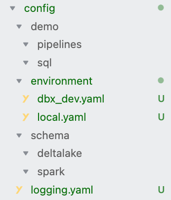
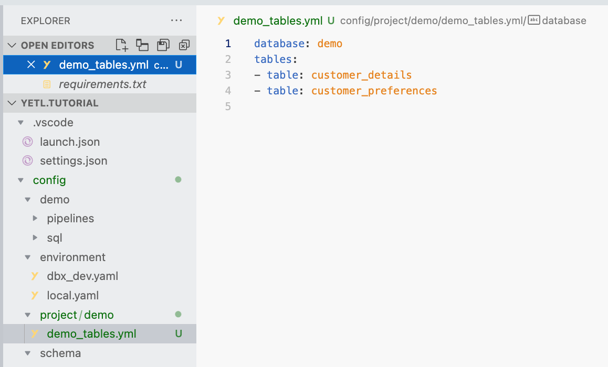
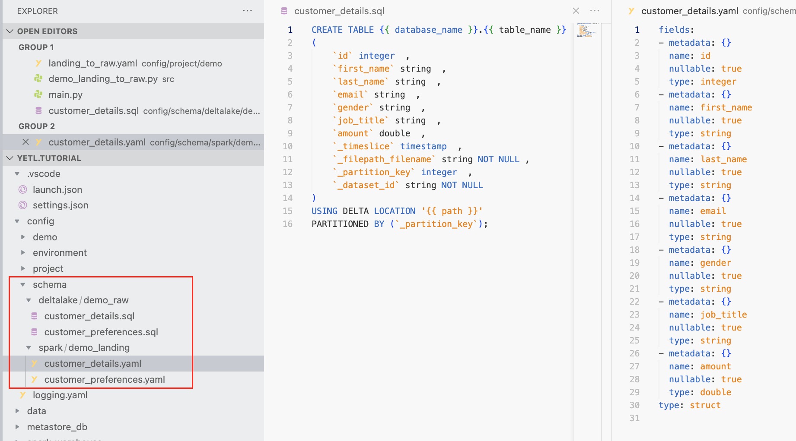

# Getting Started

Clone the tutorial.

```sh
git clone https://github.com/sibytes/yetl.tutorial.git
```

Checkout the beginning of the tutorial.

```sh
git checkout getting-started-step-0
```

Explore the project. Currently there's not much there at all, mostly a simply directory structure containing some date partitioned test data to simulate our landing data partitioned by timeslice dates. But hey, we're just getting started!

## Installation

Within the project home dir create a virtual python environment and install the required libraries. This will install `yetl-framework` and the python dependencies required for this tutorial.

```sh
python -m venv venv
source venv/bin/activate
pip install --upgrade pip
pip install -r requirements.txt
```

## Step 1 - Create a Yetl Project

Checkout the starting position.

```sh
git checkout getting-started-step-0
```

Using the Yetl cli create a new project

```sh
python -m yetl init demo 
```

This will create the following config directory:



The directories and files in the config directory are as follows:

- **environment** - Contains global level settings for yetl for the respective environment e.g. the root of the datalake where data resides. This is how yetl can be configured to run the same code locally and on databricks
- **logging.yaml** - Contains the python logging configuration
- **schema** - This is the basic schema repo that comes with yetl that stores SQL and Spark schema's organised into files on disk
- **demo** - This is where the pipeline configuration and SQL will reside for the project demo when yetl builds the configuration.

Yetl init will also create a `.venv` file containing the following:

```
YETL_ROOT=./config
YETL_ENVIRONMENT=local
```

The `.env` can be used with vscode or your IDE to create environment variables. These environment variables are required by Yetl so that it know what environment it is and where the configuration resides.


## Step 2 - Create Table Manifest

Checkout the starting position.

```sh
git checkout getting-started-step-1
```

Using the cli run the table manifest creation on a sample of the source data. This will scan the files and create a table manifest. It's uses a regex parameter to pull out the table name from the filenames:

```sh
python -m yetl create-table-manifest \
"demo" \
"./config/project"  \
File \
"./data/landing/demo" \
--filename "*" \
--extract-regex "^[a-zA-Z_]+[a-zA-Z]+"
```

This will create a `project/demo` folder in the `./config` directory and the table manifest from the data files it scanned. The project folder is where we'll create our pipeline templates that we will build into pipelines.




## Step 3 - Create Pipeline Template

Checkout the starting position.

```sh
git checkout getting-started-step-2
```

In this step will create a pipeline template for loading landing data from `./data/landing/demo` into a set of raw (bronze) deltalake tables. This template uses jinja and will be used to generate all the required pipeline configurations in the table manifest.

Create the file using the UI or the command:
```sh
touch ./config/project/demo/landing_to_raw.yaml
```

Copy and paste the following configuration into `landing_to_raw.yaml`:

```yaml
dataflow:

  demo_landing:
    {{demo_tables_table_name}}:
      type: Reader
      properties:
        yetl.schema.corruptRecord: false
        yetl.schema.createIfNotExists: true
        yetl.metadata.timeslice: timeslice_file_date_format
        yetl.metadata.filepathFilename: true
      path_date_format: "%Y%m%d"
      file_date_format: "%Y%m%d"
      format: csv
      path: "landing/demo/{{timeslice_path_date_format}}/{{demo_tables_table_name}}_{{timeslice_file_date_format}}.csv"
      read:
        auto: true
        options:
          mode: PERMISSIVE
          inferSchema: false
          header: true

  demo_raw:
    {{demo_tables_table_name}}:
      type: DeltaWriter

      partitioned_by:
        - _partition_key

      ddl: "{{root}}"
      properties:
        yetl.metadata.datasetId: true
        yetl.schema.createIfNotExists: true
        delta.appendOnly: false
        delta.checkpoint.writeStatsAsJson: true
        delta.autoOptimize.autoCompact: true       
        delta.autoOptimize.optimizeWrite: true     
        delta.compatibility.symlinkFormatManifest.enabled: false
        delta.dataSkippingNumIndexedCols: -1
        delta.logRetentionDuration: interval 30 days
        delta.deletedFileRetentionDuration: interval 1 week
        delta.enableChangeDataFeed: true
        delta.minReaderVersion: 1
        delta.minWriterVersion: 2
        delta.randomizeFilePrefixes: false
        delta.randomPrefixLength: 2
      
      format: delta
      path: delta_lake/demo_raw/{{demo_tables_table_name}}
      write:
        mode: append
        options:
          mergeSchema: true
```


## Step 4 - Build Pipeline Config

Checkout the starting position.

```sh
git checkout getting-started-step-3
```

In this step we will use the pipeline template `./config/project/demo/landing_to_raw.yaml` to create a pipeline configuration for each table in the table manifest at `./config/project/demo/demo_tables.yml`

Build the pipeline configurations by executing:
```sh
python -m yetl build \
demo \
demo_tables.yml \
landing_to_raw.yaml \
./config
```

## Step 5 - Code Pipeline

Checkout the starting position.

```sh
git checkout getting-started-step-4
```

In this step we'll use python and yetl to code a function that loads our tables.

Create a directory called `src` and a python file in that directory called `demo_landing_to_raw.py`.

```sh
mkdir ./src
touch ./src/demo_landing_to_raw.py
```

Add the following code to `demo_landing_raw.py`

```python
from yetl.flow import (
    yetl_flow,
    IDataflow,
    IContext,
    Timeslice,
    TimesliceUtcNow,
    Save,
)
from pyspark.sql.functions import *
from typing import Type

_PROJECT = "demo"
_PIPELINE_NAME = "landing_to_raw"

@yetl_flow(project=_PROJECT, pipeline_name=_PIPELINE_NAME)
def landing_to_raw(
    table: str,
    context: IContext,
    dataflow: IDataflow,
    timeslice: Timeslice = TimesliceUtcNow(),
    save: Type[Save] = None,
) -> dict:
    """Load raw delta tables"""

    source_table = f"{_PROJECT}_landing.{table}"
    df = dataflow.source_df(source_table)

    df = df.withColumn(
        "_partition_key", date_format("_timeslice", "yyyyMMdd").cast("integer")
    )

    destination_table = f"{_PROJECT}_raw.{table}"
    dataflow.destination_df(destination_table, df, save=save)

    context.log.info(f"Loaded table {destination_table}")
```


## Step 6 - Code Main

Checkout the starting position.

```sh
git checkout getting-started-step-5
```

Create a `main.py` python file in the project root.

```sh
touch ./main.py
```

Add the following pipeline that will run our pipeline for both our tables.

```py
from src.demo_landing_to_raw import landing_to_raw
from yetl.flow import Timeslice
import json

timeslice = Timeslice(2021, 1, 1)

table = "customer_details"
results = landing_to_raw(table=table, timeslice=timeslice)
results = json.dumps(results, indent=4, default=str)
print(results)

table = "customer_preferences"
results = landing_to_raw(table=table, timeslice=timeslice)
results = json.dumps(results, indent=4, default=str)
print(results)
```

## Step 7 - Initial Load

Checkout the starting position.

```sh
git checkout getting-started-step-6
```

Now for the cool bit. If you're using vscode then config files in `.vscode` included are already included in the repo that configure `main.py` to execute so you can just hit F5. Alternatively run the `main.py` however you choose.

### Loads The Data
When process runs a number of things will happen! Pyspark should fire up and yetl loads the data from the landing location to the raw deltalake tables in a database called `demo_raw. You check this and see the results by running pyspark.

```sh
pyspark
```

Then check the data is loadeded:

```python
df = spark.sql("show tables in demo_raw")
df.show()
```

Result:

```sh
+---------+--------------------+-----------+                                    
|namespace|           tableName|isTemporary|
+---------+--------------------+-----------+
| demo_raw|    customer_details|      false|
| demo_raw|customer_preferences|      false|
+---------+--------------------+-----------+
```

Query the customer_preferences table

```python
df = spark.sql("select * demo_raw.customer_preferences")
df.show()
exit()
```

Results:

```
+---+-------------+-------------------+--------------------+--------------+--------------------+
| id|allow_contact|         _timeslice|  _filepath_filename|_partition_key|         _dataset_id|
+---+-------------+-------------------+--------------------+--------------+--------------------+
|  1|         true|2021-01-01 00:00:00|file:///Users/sha...|      20210101|acff36e8-28fc-4c9...|
|  2|         true|2021-01-01 00:00:00|file:///Users/sha...|      20210101|acff36e8-28fc-4c9...|
|  3|         true|2021-01-01 00:00:00|file:///Users/sha...|      20210101|acff36e8-28fc-4c9...|
|  4|         true|2021-01-01 00:00:00|file:///Users/sha...|      20210101|acff36e8-28fc-4c9...|
|  5|         true|2021-01-01 00:00:00|file:///Users/sha...|      20210101|acff36e8-28fc-4c9...|
|  6|         true|2021-01-01 00:00:00|file:///Users/sha...|      20210101|acff36e8-28fc-4c9...|
|  7|         true|2021-01-01 00:00:00|file:///Users/sha...|      20210101|acff36e8-28fc-4c9...|
|  8|         true|2021-01-01 00:00:00|file:///Users/sha...|      20210101|acff36e8-28fc-4c9...|
|  9|         true|2021-01-01 00:00:00|file:///Users/sha...|      20210101|acff36e8-28fc-4c9...|
| 10|         true|2021-01-01 00:00:00|file:///Users/sha...|      20210101|acff36e8-28fc-4c9...|
+---+-------------+-------------------+--------------------+--------------+--------------------+
```

### Adds Lineage Columns

yetl has added the lineage columns

```sql
    `_timeslice` timestamp 
	`_filepath_filename` string
	`_partition_key` integer
	`_dataset_id` string NOT NULL 
```

### Creates The Schemas

yetl will create spark schema's for the files it loads since they don't exist yet. It will will also create SQL schema's for the DeltaLake raw tables that don't exist yet. These can then be refined and committed to your git repo as part of the yetl project which are used at runtime on subsequent loads when cloned or pulled and executed.




### Returns An Audit Result

 The returned result is a dictionary that shows what yetl did organised into a data lineage tree. For example the `customer_preferences` load will return the following:

```json
{                                                                               
    "dataflow": {
        "datasets": {
            "034adab7-9914-4ad9-8b7a-1e2cce6b6475": {
                "type": "Reader",
                "dataflow_id": "73a1749b-952f-43fe-9f62-51bf1599d7ec",
                "database": "demo_landing",
                "table": "customer_preferences",
                "path": "file:/Users/shaunryan/AzureDevOps/yetl.tutorial/data/landing/demo/20210101/customer_preferences_20210101.csv",
                "tasks": {
                    "0": {
                        "task": "lazy_read",
                        "message": {
                            "path": "file:/Users/shaunryan/AzureDevOps/yetl.tutorial/data/landing/demo/20210101/customer_preferences_20210101.csv",
                            "options": {
                                "inferSchema": true,
                                "header": true
                            }
                        },
                        "start_datetime": "2022-11-13 14:38:09",
                        "end_datetime": "2022-11-13 14:38:09",
                        "seconds_duration": 0.309594
                    }
                }
            },
            "aaed955e-61b2-48d7-9506-cc4ab246c103": {
                "type": "DeltaWriter",
                "dataflow_id": "73a1749b-952f-43fe-9f62-51bf1599d7ec",
                "database": "demo_raw",
                "table": "customer_preferences",
                "path": "file:/Users/shaunryan/AzureDevOps/yetl.tutorial/data/delta_lake/demo_raw/customer_preferences",
                "tasks": {
                    "0": {
                        "task": "sql",
                        "message": "CREATE DATABASE IF NOT EXISTS demo_raw",
                        "start_datetime": "2022-11-13 14:38:09",
                        "end_datetime": "2022-11-13 14:38:09",
                        "seconds_duration": 0.008012
                    },
                    "1": {
                        "task": "sql",
                        "message": "CREATE TABLE demo_raw.customer_preferences ( `id` integer , `allow_contact` boolean , `_timeslice` timestamp , `_filepath_filename` string NOT NULL , `_partition_key` integer , `_dataset_id` string NOT NULL ) USING DELTA LOCATION 'file:/Users/shaunryan/AzureDevOps/yetl.tutorial/data/delta_lake/demo_raw/customer_preferences' PARTITIONED BY (`_partition_key`);",
                        "start_datetime": "2022-11-13 14:38:09",
                        "end_datetime": "2022-11-13 14:38:12",
                        "seconds_duration": 2.931049
                    },
                    "2": {
                        "task": "set_table_properties",
                        "message": "ALTER TABLE `demo_raw`.`customer_preferences` SET TBLPROPERTIES ('yetl.metadata.datasetId' = 'True', 'yetl.schema.createIfNotExists' = 'True', 'delta.appendOnly' = 'False', 'delta.checkpoint.writeStatsAsJson' = 'True', 'delta.autoOptimize.autoCompact' = 'True', 'delta.autoOptimize.optimizeWrite' = 'True', 'delta.compatibility.symlinkFormatManifest.enabled' = 'False', 'delta.dataSkippingNumIndexedCols' = '-1', 'delta.logRetentionDuration' = 'interval 30 days', 'delta.deletedFileRetentionDuration' = 'interval 1 week', 'delta.enableChangeDataFeed' = 'True', 'delta.minReaderVersion' = '1', 'delta.minWriterVersion' = '2', 'delta.randomizeFilePrefixes' = 'False', 'delta.randomPrefixLength' = '2');",
                        "start_datetime": "2022-11-13 14:38:12",
                        "end_datetime": "2022-11-13 14:38:14",
                        "seconds_duration": 2.265335
                    },
                    "3": {
                        "task": "delta_table_write",
                        "message": {
                            "version": 2,
                            "timestamp": "2022-11-13 14:38:15.354000",
                            "userId": null,
                            "userName": null,
                            "operation": "WRITE",
                            "operationParameters": {
                                "mode": "Append",
                                "partitionBy": "[\"_partition_key\"]"
                            },
                            "job": null,
                            "notebook": null,
                            "clusterId": null,
                            "readVersion": 1,
                            "isolationLevel": "Serializable",
                            "isBlindAppend": true,
                            "operationMetrics": {
                                "numOutputRows": "10",
                                "numOutputBytes": "2494",
                                "numFiles": "1"
                            },
                            "userMetadata": null,
                            "engineInfo": "Apache-Spark/3.3.0 Delta-Lake/2.1.1"
                        },
                        "start_datetime": "2022-11-13 14:38:09",
                        "end_datetime": "2022-11-13 14:38:17",
                        "seconds_duration": 8.072549
                    }
                }
            }
        },
        "name": "customer_preferences_landing_to_raw",
        "args": {
            "table": "customer_preferences",
            "timeslice": "2021-01-01 00:00:00.000000"
        },
        "started": "2022-11-13 14:38:09",
        "started_utc": "2022-11-13 14:38:09",
        "context_id": "df075697-9f47-48ad-8de8-cf448625e2b3",
        "lineage": {
            "73a1749b-952f-43fe-9f62-51bf1599d7ec": {
                "aaed955e-61b2-48d7-9506-cc4ab246c103": {
                    "depends_on": [
                        "034adab7-9914-4ad9-8b7a-1e2cce6b6475"
                    ]
                }
            }
        },
        "finished": "2022-11-13 14:38:17",
        "finished_utc": "2022-11-13 14:38:17"
    },
    "warning": {
        "count": 0
    },
    "error": {
        "count": 0
    }
}
```

## Step 8 - Incremental Load

Checkout the starting position.

```sh
git checkout getting-started-step-7
```

Typically you would now refine the spark schema's by profiling the data. Spark does an ok job inferring schema's but they can always be improved. Yetl does the hard graft of auto creating all the schema's you'll need for all your tables in a project. To keep the cadence of the tutorial we'll ignore this refinement.

In this step we'll show how easy it is to do incremental load. Edit the `main.py` as follows:

```python
from src.demo_landing_to_raw import landing_to_raw
from yetl.flow import Timeslice
import json

# timeslice = Timeslice(2021, 1, 1)
timeslice = Timeslice(2021, 1, 2)

table = "customer_details"
results = landing_to_raw(table=table, timeslice=timeslice)
results = json.dumps(results, indent=4, default=str)
print(results)

table = "customer_preferences"
results = landing_to_raw(table=table, timeslice=timeslice)
results = json.dumps(results, indent=4, default=str)
print(results)
```

Now execute the pipeline again with F5. This time when the data loads it will use the schema's that were created rather than inferring them. Check that the data was loaded.

```sh
pyspark
```

Then check the data is loadeded:

```python
df = spark.sql("""
    select * 
    from demo_raw.customer_preferences 
    where _timeslice = '2021-01-02'""")
df.show()
exit()
```

Result:

```sh
+---+-------------+-------------------+--------------------+--------------+--------------------+
| id|allow_contact|         _timeslice|  _filepath_filename|_partition_key|         _dataset_id|
+---+-------------+-------------------+--------------------+--------------+--------------------+
| 11|         true|2021-01-02 00:00:00|file:///Users/sha...|      20210102|fe033f73-da59-42a...|
| 12|         true|2021-01-02 00:00:00|file:///Users/sha...|      20210102|fe033f73-da59-42a...|
| 13|         true|2021-01-02 00:00:00|file:///Users/sha...|      20210102|fe033f73-da59-42a...|
| 14|        false|2021-01-02 00:00:00|file:///Users/sha...|      20210102|fe033f73-da59-42a...|
| 15|        false|2021-01-02 00:00:00|file:///Users/sha...|      20210102|fe033f73-da59-42a...|
| 16|         true|2021-01-02 00:00:00|file:///Users/sha...|      20210102|fe033f73-da59-42a...|
| 17|        false|2021-01-02 00:00:00|file:///Users/sha...|      20210102|fe033f73-da59-42a...|
| 18|        false|2021-01-02 00:00:00|file:///Users/sha...|      20210102|fe033f73-da59-42a...|
| 19|         true|2021-01-02 00:00:00|file:///Users/sha...|      20210102|fe033f73-da59-42a...|
| 20|         true|2021-01-02 00:00:00|file:///Users/sha...|      20210102|fe033f73-da59-42a...|
+---+-------------+-------------------+--------------------+--------------+--------------------+
```

## Step 9 - Full Reload

Checkout the starting position.

```sh
git checkout getting-started-step-8
```

The data loaded incrementally because that's what it's configured to do in the write properties of the pipeline configuration, also operationally this is typically what's required so it makes sense for that to live in the configuration. However what if we want to reload all of the data or a given year or month occasionally as required? Since projects and data feeds don't always go as expected. Yetl supports this very elegantly!

To do this we have to do 2 things. We have to wildcard the timeslice path and we have to tell it to fully overwrite the data. Rather than get into a ownerous process of editing or rebuilding metadata yetl supports this using the API. 

The yetl Timeslice object supports wildcards, also we import a Save type specifically for overwritting data and inject it into the load using dependency injection without changing the pipeline function itself. Yetl will provide a number of save types in the api with the default save being the save that is configured in the pipeline yaml.

To do a full reload it's this simple! Edit the `main.py` file as follows.

```python
from src.demo_landing_to_raw import landing_to_raw
from yetl.flow import Timeslice, OverwriteSave
import json

# timeslice = Timeslice(2021, 1, 1)
# timeslice = Timeslice(2021, 1, 2)
timeslice = Timeslice("*", "*", "*")

table = "customer_details"
results = landing_to_raw(table=table, timeslice=timeslice, save=OverwriteSave)
results = json.dumps(results, indent=4, default=str)
print(results)

table = "customer_preferences"
results = landing_to_raw(table=table, timeslice=timeslice, save=OverwriteSave)
results = json.dumps(results, indent=4, default=str)
print(results)
```

Execute the pipeline by hitting F5. The pipeline will run and reload all periods data overwriting the data that was there. You can check the result in pyspark.


```sh
pyspark
```

Then check the data is loadeded:

```python
df = spark.sql("""
    select * 
    from demo_raw.customer_preferences""")
df.show()
exit()
```

Result:

```sh
+---+-------------+-------------------+--------------------+--------------+--------------------+
| id|allow_contact|         _timeslice|  _filepath_filename|_partition_key|         _dataset_id|
+---+-------------+-------------------+--------------------+--------------+--------------------+
| 11|         true|2021-01-02 00:00:00|file:///Users/sha...|      20210102|ed2ce14e-b377-48b...|
| 12|         true|2021-01-02 00:00:00|file:///Users/sha...|      20210102|ed2ce14e-b377-48b...|
| 13|         true|2021-01-02 00:00:00|file:///Users/sha...|      20210102|ed2ce14e-b377-48b...|
| 14|        false|2021-01-02 00:00:00|file:///Users/sha...|      20210102|ed2ce14e-b377-48b...|
| 15|        false|2021-01-02 00:00:00|file:///Users/sha...|      20210102|ed2ce14e-b377-48b...|
| 16|         true|2021-01-02 00:00:00|file:///Users/sha...|      20210102|ed2ce14e-b377-48b...|
| 17|        false|2021-01-02 00:00:00|file:///Users/sha...|      20210102|ed2ce14e-b377-48b...|
| 18|        false|2021-01-02 00:00:00|file:///Users/sha...|      20210102|ed2ce14e-b377-48b...|
| 19|         true|2021-01-02 00:00:00|file:///Users/sha...|      20210102|ed2ce14e-b377-48b...|
| 20|         true|2021-01-02 00:00:00|file:///Users/sha...|      20210102|ed2ce14e-b377-48b...|
|  1|         true|2021-01-01 00:00:00|file:///Users/sha...|      20210101|ed2ce14e-b377-48b...|
|  2|         true|2021-01-01 00:00:00|file:///Users/sha...|      20210101|ed2ce14e-b377-48b...|
|  3|         true|2021-01-01 00:00:00|file:///Users/sha...|      20210101|ed2ce14e-b377-48b...|
|  4|         true|2021-01-01 00:00:00|file:///Users/sha...|      20210101|ed2ce14e-b377-48b...|
|  5|         true|2021-01-01 00:00:00|file:///Users/sha...|      20210101|ed2ce14e-b377-48b...|
|  6|         true|2021-01-01 00:00:00|file:///Users/sha...|      20210101|ed2ce14e-b377-48b...|
|  7|         true|2021-01-01 00:00:00|file:///Users/sha...|      20210101|ed2ce14e-b377-48b...|
|  8|         true|2021-01-01 00:00:00|file:///Users/sha...|      20210101|ed2ce14e-b377-48b...|
|  9|         true|2021-01-01 00:00:00|file:///Users/sha...|      20210101|ed2ce14e-b377-48b...|
| 10|         true|2021-01-01 00:00:00|file:///Users/sha...|      20210101|ed2ce14e-b377-48b...|
+---+-------------+-------------------+--------------------+--------------+--------------------+
```

## Step 10 - Parallel Load

Checkout the starting position.

```sh
git checkout getting-started-step-9
```


## Step 10 - Deploy To Databricks

Checkout the starting position.

```sh
git checkout getting-started-step-10
```

